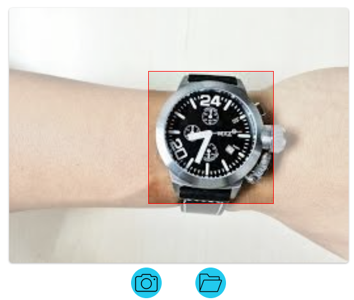
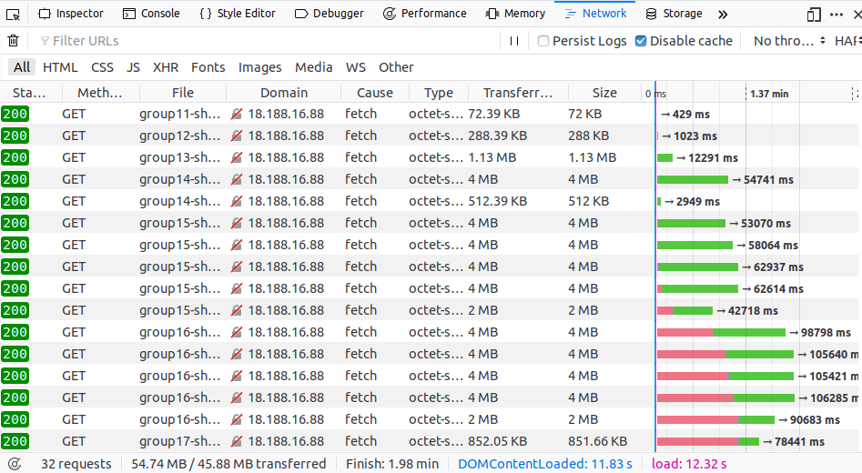
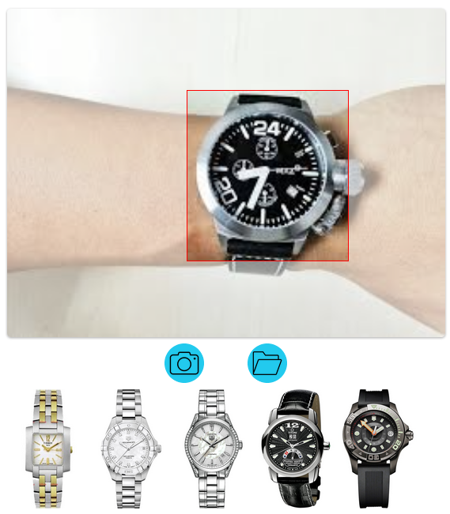
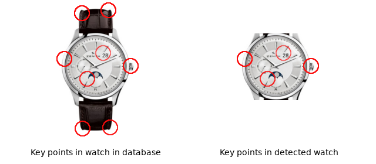

# Detection and recognition of wrist watches

## Introduction

Current technology allows the creation of solutions that improve the user experience when shopping online. The site [Ethos Watch Boutiques](https://www.ethoswatches.com/) requires the creation of a web module that facilitates the shopping experience for its customers.

The solution involves machine learning and computer vision technologies to make searching watches easier. The entire process is split into two main components: detection and recognition.

## Detection
The objective of this component is to automatically find wrist watches in video sequences from camera devices and still images. The output is a set of images of the detected the watches. Currently, this feature has been limited to detect a single watch, as seen in **Image 1**.

	
	
Image 1: Detection of wrist watches from images.

### Implementation
Originally, this component was implemented using **haar cascades**. However, this technology was avoided due to the long time required to train the classifier. Depending on the number of samples and their sizes, the training time can take weeks. This problem is difficult to overcome since the process is done in CPU, and it allows a maximum of 4 cores.

The current solution utilises **YOLO** technology. The main advantage is the robustness and accuracy to detect different classes of objects (including wrist watches). However, since it is a general purpose model, its size is quite big: `40 MB`. This means a considerable amount of time is required to download it as seen in **Image 2**.

	
	
Image 2: YOLO average download times.

### Improvements to do
- Creating an efficient machine learning model to especifically detect watches.
- Replacing **YOLO** with the new model.

## Recognition
Once a wrist watch has been detected, the recognition component is in charge of finding the most similar watches in the database of the site. The output of this process is a list of images of the most similar watches as seen in **Image 3**.

	
	
Image 3: List of watches based on the detected one.

### Implementation
Recognition is done by comparing a given watch against all those in the database. This requires to define a descriptor that characterises the most relevant features of watches. Therefore, there are two important elements: **key points** and **descriptor**. Key points are parts of an image that stand out. In other words, they can be clearly recognized. A descriptor is an element that encodes the key points of an image, so they can be identified from one another.

Key points are detected with the [SIFT](https://en.wikipedia.org/wiki/Scale-invariant_feature_transform) feature detection algorimth. Then, the detected key points are encoded using the SIFT descriptor. The combination of the encoded key points is the descriptor of a given watch. This process is applied to every element in the database. The results are stored in a file that maps every watch descriptor to an url of its image.

After the module detects a watch, it sends the image to the recognition component. There, the watch image is converted to a key points encoded version. This version is then compared against all the encoded watches in the file mentioned above. Then, those who are closer to the detected watch are selected, and their urls are sent back.

The main drawback of the current solution is that the watches in the database include the belt. However, the detection module only captures the case of the wrist watch. This means that the detected key points for the same watch are different for the image in the database and the one sent by the detection module, as seen in **Image 4**.

	
	
Image 4: Difference of key points for the same watch.

This difference in the keypoints affects the result of the recognition module. In some cases, a detected watch that is present in the database is not part of the results of the recognition module.

#### Improvements to do

- Improving the descriptor by adding color information to increase the accuracy when comparing watches.

It is also possible to crop the images in the database to remove the belt. This will also improve the model in the detection module.